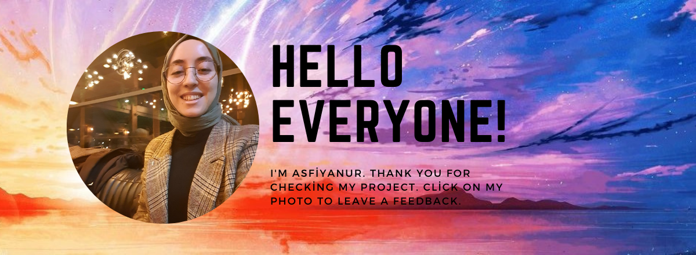

# Bursa Landmarks

## Table of contents

  - [Project Skeleton ](#project-skeleton)
  - [Screenshot](#screenshot) 
  - [Links](#links)
  - [Built with](#built-with)
  - [Useful resources](#useful-resources)
  - [Author](#author)

## Screenshot

## Links

<b>Check The Live Website ➡️</b> <a href="https://asfiyanur.github.io/BursaLandmarks/">Live Website</a>

### Built with

- JS DOM Manipulation
- Semantic HTML5 markup
- CSS custom properties
- Flexbox
- CSS Grid
- Media Query
- React
- Bootstrap
- Sass

### Useful resources

- https://www.npmjs.com/ - This site is helped about how I use sass and bootstrap .

- https://reactjs.org/ - It is helped me understand how I use some Component.

- [W3 Schools](https://www.w3schools.com/) - This is a good document which helped me understand how I use some DOM Manipulation properties.

- https://www.bizevdeyokuz.com/bursa-tarihi-yerler/ - I used the information and pictures about Bursa from this site .

## Author

- Author - [Asfiyanur]

 &#8987; Happy Coding  &#9997; 

